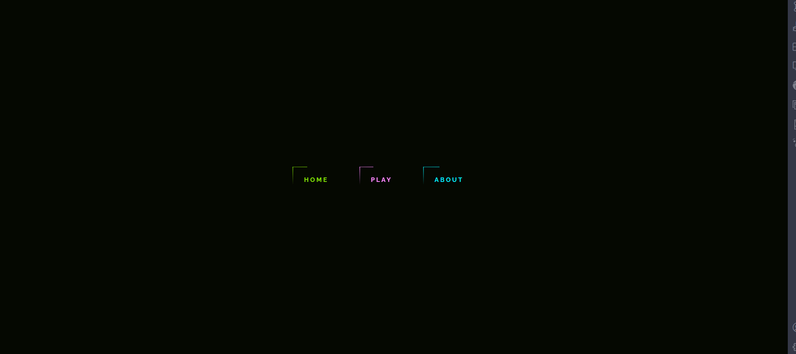

# To Serve A Master Game
This project was made for my english intersession.

This game is base on the a short story call To Serve A Master, which about a robot being ruin and it ask a human to get them parts that they need to fix itself. 

After the robot is fixed their two scenario can happen. One the robot finish fixing itself and will start to recreate other robots and kill the humans.The second scenerio the human gets executed because it help a robot, but the robot had time to hide itself and slowly and surely starts to create a revolution

this game just simply ask the user to go collect a single item. by selecting the right picture:

# The default Page

# About Page

# Play State Pages

this image is the intro page before giving the user the intruction about the game

then it is follow by the intruction that slowly appear on the screen:

then it tells the user which tool they have to look for

then you get the item and if you get the wrong one their's an error message

but finally when you selected the right object it will allow you to choose a scenerio

then you can select which scenerio you want

then you go to the information of that scenerio and at the end you go back the home page
